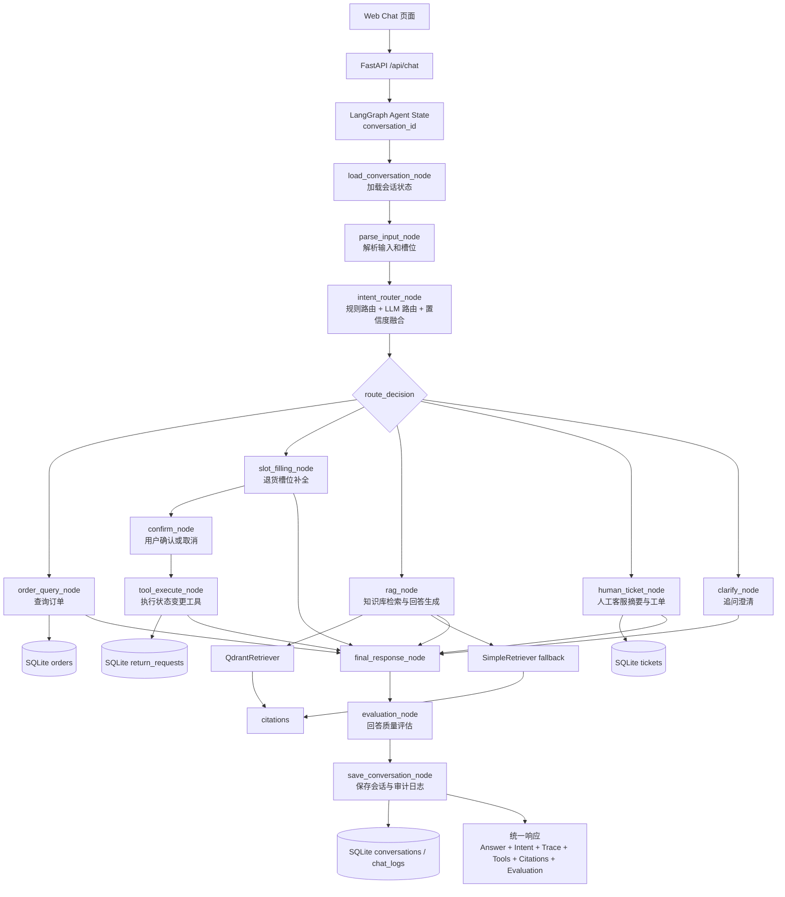

# ServiceFlow Agent Console

ServiceFlow Agent Console 是一个本地可运行的企业级客服 Agent 控制台。它面向电商和数码产品售后场景，把意图识别、工作流路由、业务工具、知识库检索、人工接管和质检证据放在同一套可审阅界面里。

项目代码位于 [`serviceflow-agent-demo`](./serviceflow-agent-demo) 目录。目录名仍保留历史命名，产品展示名统一为 **ServiceFlow Agent Console**。

## 产品定位

普通 RAG 通常把用户问题直接送去知识库检索，再生成回答。ServiceFlow 会先识别意图，再通过 LangGraph 路由到不同流程：有些问题查 SQLite 订单库，有些调用模拟 ERP 工具，有些检索指定知识库，有些创建人工客服工单。每次响应都会返回 `route_trace`、`tool_calls`、`retrieved_docs`、`citations`、`evaluation_result` 和 `ticket_id`，方便审阅 Agent 的决策过程。

## 核心能力

- 混合意图路由：规则路由 + OpenAI-compatible LLM 路由 + 置信度融合。
- LangGraph 工作流：订单、退货、退款、技术支持、政策问答、产品咨询、投诉和人工接管分支。
- 工具调用确认：退货申请、工单创建等状态变更需要用户确认或进入高风险分支。
- 检索增强回答：优先使用 Qdrant，失败时自动回退到本地 Markdown 检索。
- 可审阅证据：展示 slots、route trace、tool calls、retrieved docs、citations、evaluation 和 ticket。
- 人工接管闭环：后台可认领会话、人工回复、处理工单并关闭会话。

## 控制台界面

- `/`：客服对话工作区，左侧对话，右侧保持路由、工具、检索和质检证据可见。
- `/login`：后台登录页，支持 `admin / admin` 和 `service_agent / agent` 两组本地账号。
- `/admin`：后台控制台，包含会话、工单、知识库、日志、Trace、Metrics、Evaluation 和反馈视图。
- 前端使用原生 HTML/CSS/ES Modules，无 React、Tailwind、Vite 或额外构建步骤。

## 工程与质量保障

- 自动化测试覆盖认证、健康检查、Agent 业务闭环、人工接管、工具函数、Retriever、Trace、RBAC 和前端静态契约。
- 评测集覆盖 `intent`、`rag`、`tool`、`e2e` 四类样本，报告写入 `reports/eval_report_日期.md`。
- 压测脚本 `python scripts/load_test.py --users 20 --requests 200` 会生成压测报告。
- GitHub Actions 执行 lint、pytest 和轻量评测。
- 工程文档位于 `serviceflow-agent-demo/docs/`。

## 角色说明

- `customer`：普通用户，可以使用 `/` 发起聊天、转人工、提交回答反馈。
- `agent`：人工客服，登录 `/login` 后可在 `/admin` 查看并认领会话、回复用户、处理工单。
- `admin`：管理员，登录 `/login` 后可在 `/admin` 管理知识库、查看日志、Trace、Metrics 和质检统计。

## 系统架构图



## 功能列表

- 规则意图识别：订单、退货、退款状态、技术、政策、产品、投诉、人工、未知。
- LangGraph 工作流：每个节点写入 `route_trace`。
- SQLite 业务数据库：订单、退货申请、人工工单。
- 模拟 ERP 工具：订单查询、退货创建、退款状态、工单创建。
- Qdrant 知识库检索：按 `tech`、`policy`、`product` 写入向量库，并带 metadata filter 检索。
- SimpleRetriever 兜底：Qdrant 未启动或不可用时，自动回退到本地 Markdown 检索。
- 调试证据：展示命中的知识库、来源文件、相似度分数、检索器类型和原始 retrieved docs。
- 无 LLM 降级模式：未配置 API Key 时仍可通过规则和模板跑通。
- 多轮槽位补全：退货流程会跨轮保存订单号和退货原因。
- 状态变更确认：退货单只会在用户回复“确认”后创建，取消不会写入退货记录。
- 审计日志：`chat_logs` 记录每轮 route_trace、tool_calls、retrieved_docs、citations 和 evaluation_result。
- Web Chat 页面：左侧对话，右侧展示 Agent 调试证据。
- Admin Console：通过登录页进入，使用 Bearer token 访问后台 API，支持 hash 路由切换管理视图。

## 技术栈

- Python 3.11+
- FastAPI
- LangGraph
- Pydantic
- SQLite
- SQLAlchemy
- Qdrant
- Uvicorn
- 原生 HTML / CSS / ES Modules

## 常用命令

```bash
make dev
make test
make eval
make lint
make format
make coverage
make docker-up
make docker-down
```

## 快速启动（无需 Qdrant）

```bash
cd serviceflow-agent-demo
python -m venv .venv
source .venv/bin/activate
pip install -r requirements.txt
python app/seed.py
uvicorn main:app --reload
```

访问：

```text
http://127.0.0.1:8000
http://127.0.0.1:8000/login
http://127.0.0.1:8000/admin
```

本地后台账号：

```text
admin / admin
service_agent / agent
```

这个模式不要求 Qdrant 已启动。后端会优先尝试 Qdrant，如果连接失败，会自动使用 `SimpleRetriever`，方便快速启动和离线验证。

后台 API 默认使用 Bearer token。登录页会调用 `POST /api/auth/login` 并保存会话 token；`X-User-Role` 只在显式设置 `DEMO_AUTH_ENABLED=true` 的本地演示模式下生效，不应作为生产认证方式。

命令行登录示例：

```bash
curl -X POST http://127.0.0.1:8000/api/auth/login \
  -H "Content-Type: application/json" \
  -d '{"username":"admin","password":"admin"}'
```

## Qdrant 启动方式

启动 Qdrant：

```bash
cd serviceflow-agent-demo
docker compose up -d qdrant
```

Qdrant 默认 REST 地址：

```text
http://127.0.0.1:6333
```

安装依赖并写入知识库向量：

```bash
python -m venv .venv
source .venv/bin/activate
pip install -r requirements.txt
python -m app.rag.index_qdrant
```

启动控制台：

```bash
python app/seed.py
uvicorn main:app --reload
```

### Qdrant 环境变量

```bash
QDRANT_URL=http://127.0.0.1:6333
QDRANT_COLLECTION=serviceflow_knowledge
QDRANT_VECTOR_SIZE=384
QDRANT_ENABLED=true
```

### LLM 环境变量

```bash
OPENAI_API_KEY=
OPENAI_BASE_URL=https://api.openai.com/v1
OPENAI_MODEL=gpt-4.1-mini
```

如果 `OPENAI_API_KEY` 为空，系统会自动进入 fallback 模式：

- 意图识别使用规则路由；
- RAG 回答使用检索文档模板生成；
- 人工工单摘要使用模板摘要；
- 回复质量评估使用轻量规则评估。

每个 chunk 写入 Qdrant 时会携带这些 metadata：

```json
{
  "knowledge_base": "tech",
  "source_file": "knowledge_base/tech/smart_router_wifi.md",
  "product_name": "SmartRouter X1",
  "category": "smart_router_wifi"
}
```

检索时会根据 intent 自动添加 filter：

```text
TECH_SUPPORT -> knowledge_base = tech
POLICY_QA    -> knowledge_base = policy
PRODUCT_QA   -> knowledge_base = product
```

如果问题中识别出 `SmartRouter X1` 或 `SmartCamera C2`，还会追加 `product_name` filter。

## 测试问题示例

- 帮我查一下订单 10001 到哪里了
- 我要退货
- 10001
- 买错了
- 确认
- 取消
- 我要退货，订单号 10003，原因是买错了
- 路由器怎么连接 WiFi
- 7 天无理由退货规则是什么
- SmartRouter X1 支持 macOS 吗
- 我要投诉，转人工客服

## 多轮对话与确认机制

退货申请的必填槽位是 `order_id` 和 `return_reason`。如果用户第一轮只说“我要退货”，Agent 会追问订单号；第二轮用户回复“10001”，Agent 会继续追问退货原因；第三轮用户回复“买错了”，Agent 只设置 `pending_action=CREATE_RETURN_REQUEST` 并提示确认。只有用户再回复“确认”时，`tool_execute_node` 才会调用 `create_return_request`。

取消词包括：`取消`、`算了`、`不用了`、`先不退了`。确认词包括：`确认`、`是的`、`可以`、`提交`、`帮我创建`。

## 人工接管流程

当 Agent 判断需要人工介入时，会创建工单，并将会话状态改为 `WAITING_HUMAN`、`handoff_status=REQUESTED`。客服在后台认领后，会话变为 `HUMAN_HANDLING`、`handoff_status=ASSIGNED`，后续用户在普通聊天页继续发消息时，系统只写入会话历史并返回“人工客服正在处理中，请等待客服回复。”，不会再调用 Agent 自动回复。

客服通过后台“人工回复”写入 `conversation.history`，消息的 `sender` 为 `human_agent`。普通聊天页会轮询当前会话历史，因此可以看到人工客服回复。会话关闭后状态为 `CLOSED`、`handoff_status=RESOLVED`；第一版中，如果用户继续发消息，会重新激活会话。

## 工单处理流程

后台工单管理支持查看、认领、处理和关闭。工单状态流转为：

```text
OPEN -> ASSIGNED -> RESOLVED -> CLOSED
```

认领会写入 `assigned_agent_id`，处理会写入 `resolution` 和 `updated_at`。

## 知识库管理流程

管理员可在后台创建知识库文档，文档默认 `DRAFT`、`version=1`。发布文档时，系统会写入：

```text
knowledge_base/{tech|policy|product}/{doc_id}.md
```

如果 Qdrant 可用，会尝试重建索引；如果 Qdrant 不可用，则依靠 `SimpleRetriever` fallback，下一次检索会读取新 Markdown 文档。

## 质量反馈流程

普通聊天页支持：

- 👍 有帮助
- 👎 没帮助

差评可选择：答非所问、工具调用错误、没有引用来源、我想找人工客服。反馈会写入 `agent_feedback`，后台质量反馈页会展示反馈列表和 `evaluation-summary` 统计。

## API 示例

### POST /api/chat

```bash
curl -X POST http://127.0.0.1:8000/api/chat \
  -H "Content-Type: application/json" \
  -d '{"message":"我要退货","user_id":"U1001","conversation_id":null}'
```

响应会包含：

```json
{
  "conversation_id": "C202606060001",
  "answer": "请提供需要退货的订单号。",
  "intent": "RETURN_REQUEST",
  "confidence": 0.86,
  "slots": {"order_id": null, "return_reason": null},
  "missing_slots": ["order_id"],
  "pending_action": null,
  "awaiting_user_input": true,
  "route_trace": ["load_conversation_node", "parse_input_node", "intent_router_node", "slot_filling_node", "final_response_node"],
  "route_debug": {},
  "tool_calls": [],
  "retrieved_docs": [],
  "citations": [],
  "evaluation_result": {},
  "need_human": false,
  "ticket_id": null
}
```

### GET /api/conversations/{conversation_id}

返回当前会话状态，包括 `current_intent`、`pending_action`、`slots` 和 `history`。

### GET /api/conversations/{conversation_id}/logs

返回当前会话完整日志，每轮包含 `route_trace`、`tool_calls`、`retrieved_docs`、`citations` 和 `evaluation_result`。

### POST /api/conversations/{conversation_id}/reset

重置当前会话状态，清空 slots、history 和 pending_action。

### 后台管理 API

- `GET /api/admin/conversations`
- `GET /api/admin/conversations/{conversation_id}`
- `POST /api/admin/conversations/{conversation_id}/assign`
- `POST /api/admin/conversations/{conversation_id}/reply`
- `POST /api/admin/conversations/{conversation_id}/resolve`
- `GET /api/admin/tickets`
- `GET /api/admin/tickets/{ticket_id}`
- `POST /api/admin/tickets/{ticket_id}/assign`
- `POST /api/admin/tickets/{ticket_id}/resolve`
- `POST /api/admin/tickets/{ticket_id}/close`
- `GET /api/admin/knowledge-documents`
- `POST /api/admin/knowledge-documents`
- `PUT /api/admin/knowledge-documents/{doc_id}`
- `POST /api/admin/knowledge-documents/{doc_id}/publish`
- `POST /api/admin/knowledge-documents/{doc_id}/archive`
- `POST /api/admin/knowledge-documents/reindex`
- `POST /api/feedback`
- `GET /api/admin/feedback`
- `GET /api/admin/evaluation-summary`
- `GET /api/admin/chat-logs`

### Trace / Metrics / Evaluation API

- `GET /api/admin/traces`
- `GET /api/admin/traces/{trace_id}`
- `GET /api/admin/metrics/overview`
- `GET /api/admin/metrics/daily`
- `GET /api/admin/evaluation-reports`
- `GET /api/admin/evaluation-reports/latest`
- `GET /api/admin/evaluation-reports/{filename}/download`

## 自动化测试

```bash
cd serviceflow-agent-demo
make test
make coverage
```

测试目录按能力拆分：认证、健康检查、Agent 业务闭环、人工接管、工具函数、Retriever、Trace、RBAC 和 tenant 契约。当前仓库仍是 SQLite 单体控制台，完整 PostgreSQL/Redis/MinIO/多租户强隔离测试在本阶段以契约或 skip 标注保留入口。

## Agent 评测集

```bash
cd serviceflow-agent-demo
make eval
python evals/run_eval.py --dataset intent
python evals/run_eval.py --dataset rag
python evals/run_eval.py --dataset tool
python evals/run_eval.py --dataset e2e
```

评测数据位于 `evals/datasets/`，报告写入 `reports/eval_report_日期.md`。新增评测样本时保持 JSONL 每行一个样本，并补充 `id`、`tenant_id`、输入和期望字段。

## Trace 与 Metrics

每次聊天响应都会返回 `trace_id`。登录 `/admin` 后，Agent Trace 页面可以查看完整节点链路；Metrics 看板展示今日对话数、响应时间、意图分布、工具成功率、人工转接率和错误率。

## 压测

先启动服务，再执行：

```bash
cd serviceflow-agent-demo
python scripts/load_test.py --users 10 --requests 100
```

脚本会输出成功率、平均响应时间、P95、QPS，并生成 `reports/load_test_report_日期.md`。

## 后台验收流程

### 测试一：人工转接

用户输入“我要找人工客服”。

期望：Agent 创建工单；`conversation.status` 变为 `WAITING_HUMAN`；后台会话列表出现该会话；后台工单列表出现对应工单。

### 测试二：客服认领会话

后台点击认领。

期望：`conversation.status` 变为 `HUMAN_HANDLING`；`assigned_agent_id` 写入当前客服。

### 测试三：客服回复

客服发送“您好，我是人工客服，请问您遇到了什么问题？”

期望：用户聊天页面能看到人工客服回复；`sender` 为 `human_agent`；Agent 不自动回复。

### 测试四：知识库新增

管理员新增 policy 文档“延保服务政策”，发布后用户提问“SmartRouter X1 有延保服务吗？”

期望：Agent 能检索到新文档；`citations` 包含新文档。

### 测试五：用户反馈

用户对 Agent 回答点“没帮助”。

期望：`agent_feedback` 表新增记录；后台质量反馈页面可看到；`evaluation-summary` 统计更新。

### GET /api/orders/{order_id}

```bash
curl http://127.0.0.1:8000/api/orders/10001
```

### GET /api/tickets

```bash
curl http://127.0.0.1:8000/api/tickets
```

### GET /api/returns

```bash
curl http://127.0.0.1:8000/api/returns
```

## 后续扩展方向

- 替换当前 HashEmbedding 为 OpenAI-compatible embedding 或本地 embedding 模型。
- 为 Qdrant 增加 collection schema 版本、批量重建和增量索引。
- 接入真实 ERP，把工具函数从 SQLite 模拟替换成真实 API。
- 接入客服后台，处理工单分配、状态流转和 SLA。
- 加入人工审核，允许客服确认退货或投诉处理结果。
- 强化权限模型、人工审核队列、跨渠道会话合并、embedding 服务配置化和更严格的 LLM Judge 评测集。
