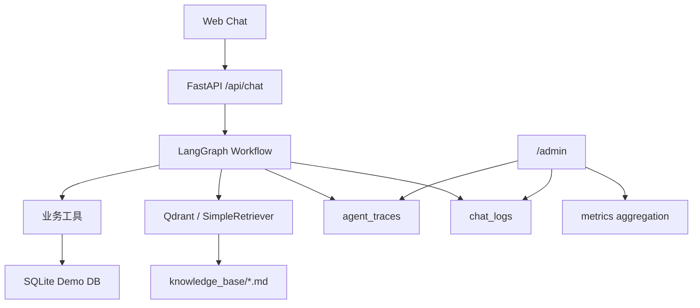

# 架构说明

ServiceFlow 当前是单体 FastAPI Demo，核心链路是：

V0.6 的重点不是重写业务，而是在现有 Agent 外围补上工程可信度：

- 每次请求生成 `trace_id`。
- 每个 LangGraph 节点写入 `agent_traces`。
- API 错误统一由 `app/core/exceptions.py` 管理。
- 测试、评测、压测和 CI 使用同一套命令入口。

当前仓库仍是 SQLite 可运行 Demo；PostgreSQL、Redis、MinIO、多租户强隔离和完整 RBAC 可在后续企业部署分支中替换底层适配器。
